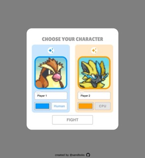
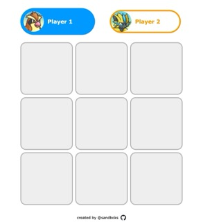
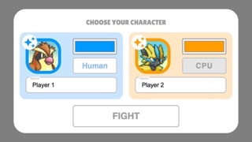
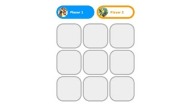

# ACCESS HERE:
https://sandboks.github.io/odin-tictactoe/

# PREVIEW
https://github.com/user-attachments/assets/c98a7948-2c44-4055-ab12-20f446974b3f

Desktop:

  
  

Mobile:
 
  

# OVERVIEW
- Created for the Odin Project's [Tic Tac Toe assignment](https://www.theodinproject.com/lessons/node-path-javascript-tic-tac-toe)
- As part of the assignment, the javascript code uses the Factory Pattern to create "private" functions and variables, with "as little global code as possible"

# FEATURES
- Play Tic Tac Toe!
- Customize each player, including their avatar, name and color
- Creatively bankrupt? Use the shuffle feature to generate funny player names from a database of over 100 words!
- Play against an AI-controlled CPU, or pit two of them against each other!
- Responsive layout that's fully playable across different devices

# COMBATIBILITY
- ✅ Google Chrome (desktop)
- ✅ Firefox (desktop)
- ✅ Safari (desktop)
- ✅ Safari (iOS)

# RETROSPECTIVE
- While the basic game logic was completed within a day, I spent much, much longer polishing the visuals and UX, and adding extra features
- My goal was to create the absolute best game I could possibly make, with my current skillset and knowledge
- ... even if that game was something as basic as Tic Tac Toe
- There are many things I attempted in previous projects that this one does significantly better
- I learned a lot making this, and did tons of my own research outside the Odin Project to implement features I wanted

# NEW SKILLS ACQUIRED
- @media rules (responsive layout)
- javascript design patterns
- SVG color manipulation
- css masking properties
- 'cqmin' units
- 'Promise' and 'resolve' keywords to create artifical pauses
- blocking mouse input with an invisible overlay
- using multiple js files in one project
- name generation
- color generation
- quantifying how similar 2 given colors are
- triggering a css animation and ending it on the last frame, repeatedly
- testing across multiple browsers
- animations to transition between different states of the webpage
- basic CPU player AI using a heuristic

# SELF CRITIQUE
- the .css file is massive (1000+ lines). In future, I need to find ways to organize it better and make it more manageable
- similarly, the main script.js file could be split into smaller pieces, to reflect the way the code is already divided into different controller "objects" that manage different parts of the logic

# SUPERFLUOUS EXTRAS I'D LIKE TO DO IN FUTURE
- add variable CPU difficulty
- add an intro screen
- add a 2nd screen where you choose the number of rounds to play?
- update the HUD to include number of rounds won
- dark mode

# CREDITS
Material design icons:  
https://pictogrammers.com/library/mdi/

Some ideas were lifted from:  
https://codebrainer.com/blog/tic-tac-toe-javascript-game

Pokemon Mystery Dungeon sprites belong to Nintendo, ripped from here:  
https://sprites.pmdcollab.org/

Some avatars created as fanart by Twitter user Ernmuffin:  
https://x.com/Ernmuffin

Modal animations inspired by:  
https://codepen.io/designcouch/pen/obvKxm
